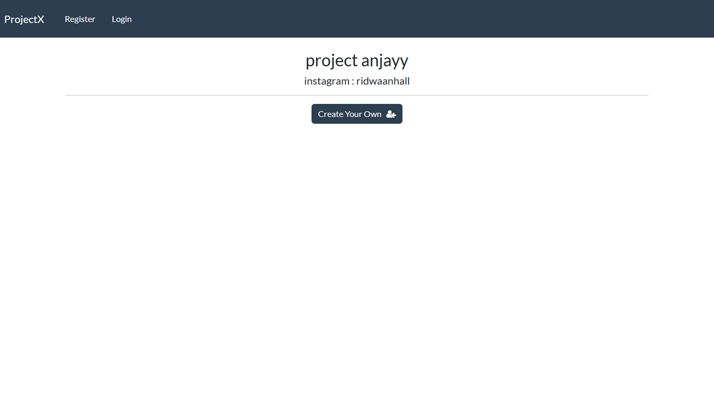

# CRUD WITH DJANGO

## Table of Contents
- [Features](#features)
- [Requirements](#requirements)
- [Getting Started](#getting-started)
  - [Installation](#installation)
  - [Running the Development Server](#running-the-development-server)
- [Contributing](#contributing)
- [License](#license)

## Features

- Create, read, update, and delete records with Django

## Requirements

- asgiref==3.7.2
- Django==4.2.7
- django-crispy-forms==1.14.0
- sqlparse==0.4.4
- tzdata==2023.3

## Getting Started

### Installation

1. Clone the repository:

   ```bash
   git clone https://github.com/ridwaanhall/CRUD-mastery-with-Django.git

2. Enter the project directory:
   ```bash
   cd CRUD-mastery-with-Django/crm

3. Make venv:
   ```bash
   virtualenv venv

4. Install dependencies:
   ```bash
   pip install -r requirements.txt

### Running the Development Server
1. Make migrations:
   ```bash
   python manage.py makemigrations

2. Migrate:
   ```bash
   python manage.py migrate

3. Make superuser:
   ```bash
   python manage.py createsuperuser

4. Start the development server:
   ```bash
   python manage.py runserver

5. Open http://127.0.0.1:8000 in your browser.

6. Click on the link to create your own account.

7. Happy coding!

## Contributing

## License